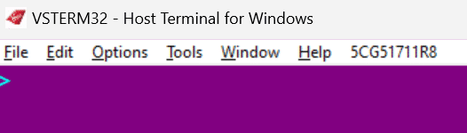

## Accessing VSTerm

VSTerm can be opened in **two ways**:

### 1️⃣ From SNAPP
- Open **SNAPP**.
- Click on the **Apps** link.
- Select **VSTerm**.

### 2️⃣ As a standalone application from CUTE
- Open the **main menu of the CUTE system**.
- Select **VSTerm** as a standalone application.

</img>

VSTerm is the native system engine that sits behind SNAPP. It holds all guest bookings and system information relating to check-in, gates, ticketing, and ancillary sales.

</img>

## VSTerm Keyboard System

VSTerm is a **keyboard entry-based system**, which involves the use of specific entries (codes) to perform actions.

Below is a table that shows the **keyboard location of the main VSTerm delimiters**.

</img>

## VSTerm Window Layout

Within the **VSTerm window**, the **system toolbar** will always be displayed at the top of the screen.

</img>

## VSTerm Toolbar Functions

Below is a table which lists all the separate **functions you will find in the toolbar**.

</img>

## VSTerm Check-In Module

Here, we will learn about the **VSTerm Check-In process**.

#### Accessing VSTerm 

To log in to VSTerm, use the **LOG code** provided to you.  

#### VSTerm Login Example 

Simulated VSTerm session showing login and system messages:
 

 VSTERM32 - Host Terminal for Windows
 File   Edit     Options     Tools   Window  Help   L5CG902493S

  

  &gt;LOG/A/037915/PD&lt;&gt;
  &lt;ENTER PASSWORD&gt;
  ***********
  

#### VSTerm Login Example 

Simulated VSTerm session showing login and system messages:
 

 VSTERM32 - Host Terminal for Windows
 File   Edit     Options     Tools   Window  Help   L5CG902493S

  

    A-LOGON COMPLETE/03JUN-ML/PD
    DLM A/PD
    AIR4 PRODUCTION-USERS MUST COMPLY WITH VAA SECURITY POLICY
    VSTerm>
  

## LOG Codes / Códigos LOG

These codes are used to track **logins** and system access in VSTerm.

| Segment / Segmento | Meaning / Significado |
|-------------------|----------------------|
| LOG               | Login / system access / Inicio de sesión |
| A–D               | Connection channel / Canal de conexión (A, B, C, D) |
| 037915            | Worker ID / ID del trabajador |
| PD                | Primary Duty / Función principal asignada |

#### VSTerm Login Messages 

| Message  | Meaning  |
|------------------|---------------------|
| A-LOGON COMPLETE | Login successful |
| 03JUN-ML/PD      | Date / system session info  |
| DLM A/PD          | Connection channel and primary duty info  |
| AIR4 PRODUCTION-USERS MUST COMPLY WITH VAA SECURITY POLICY | Reminder  |
| VSTerm>           | System prompt ready for next commands  |

#### VSTerm Keyboard Shortcuts

| Key | Function |
|-----|---------|
| **F12** | Clear the screen |

Simulated VSTerm session showing login and system messages:
 

 VSTERM32 - Host Terminal for Windows
 File   Edit     Options     Tools   Window  Help   L5CG902493S

  

>
  

## Searching for a Booking in VSTerm

You can display a guest booking by using **flight and surname**.  

Example:
> **503** – Flight

> **LAWRENCE** –  Surname 

Simulated VSTerm session showing login and system messages:
 

 VSTERM32 - Host Terminal for Windows
 File   Edit     Options     Tools   Window  Help   L5CG902493S

  

>503//$LAWRENCE
  

Simulated VSTerm session showing login and system messages:
 

 VSTERM32 - Host Terminal for Windows
 File   Edit     Options     Tools   Window  Help   L5CG902493S

  

VS RECORD LOCATOR CSY8YE         ETKT PRESENT-SEE ETR* AND *T!
1\. 1LAWRENCE/MATTHEW    2. 1LAWRENCE/SARAH«
 &nbsp;&nbsp;1 VS 503Y 03JUN1 LHRJFK HK2         600P  825P
 &nbsp;&nbsp;2 VS 504Y 03JUN1 JFKLHR HK2        1159P 1030AY1
HA FAX- ** SSRS PRESENT **«
NO FF DATA«
TKT-TK/TE/TL30/03JUN1314/LHR«
TKI-E/ADDL«
FARE«
4P A-GBP  2706.00 TX 473.79        TTL  3179.79 ML03JUN«
FARE CALC«
A LON VS NYC M1694.86YYSOADSA VS LON M1694.86YYSOADSA NUC339Y«
  

### Explanation of Each Line / Meaning

| Line / Field | Meaning |
|--------------|---------|
| `VS RECORD LOCATOR CSY8YE` | Unique system locator for the booking (like a PNR). |
| `ETKT PRESENT-SEE ETR* AND *T!` | Electronic ticket present, check ETR* and *T commands for details. |
| `1. 1LAWRENCE/MATTHEW  2. 1LAWRENCE/SARAH` | Passenger names in the booking. |
| `1 VS 503Y 03JUN1 LHRJFK HK2` | Flight 503Y, departure 03JUN, route LHR → JFK, HK2 = 2 seats held. |
| `600P 825P` | Scheduled departure and arrival times for flight 503. |
| `2 VS 504Y 03JUN1 JFKLHR HK2` | Return flight 504Y, 03JUN, route JFK → LHR, 2 seats held. |
| `1159P 1030AY1` | Scheduled departure and arrival times for flight 504. |
| `HA FAX- ** SSRS PRESENT **` | Special service requests (SSR) present; HA = handling agent; fax info included. |
| `NO FF DATA` | No frequent flyer data for passengers. |
| `TKT-TK/TE/TL30/03JUN1314/LHR` | Ticketing info: TK = ticketed, TE/TL = ticketing office, date/time/location of issuance. |
| `TKI-E/ADDL` | Ticketing entry details, additional info. |
| `FARE` | Fare section header. |
| `4P A-GBP 2706.00 TX 473.79 TTL 3179.79 ML03JUN` | 4 passengers, adult fare GBP 2706, taxes 473.79, total 3179.79, ML = date of fare calculation 03JUN. |
| `FARE CALC` | Fare calculation header. |
| `A LON VS NYC M1694.86YYSOADSA VS LON M1694.86YYSOADSA NUC339Y` | Fare calculation route LON → NYC and back, amounts in each leg, NUC = neutral unit of conversion. |

---

💡 **Tip:**  
This layout is **typical for VSTerm**: each line contains **key info for flights, passengers, tickets, fares, and special requests**. Memorizing the meaning of each section helps agents process check-in efficiently.  

#### VSTerm Check-In Entry: PS*

| Entry | Function |
|-------|---------|
| **PS\*** | Passport and document details |
| `1`   | Passenger **number 1** in the booking (the first passenger listed) |

#### Practical Example

Suppose you have the following booking:

1. 1LAWRENCE/MATTHEW  
2. 1LAWRENCE/SARAH

Simulated VSTerm session showing login and system messages:
 

 VSTERM32 - Host Terminal for Windows
 File   Edit     Options     Tools   Window  Help   L5CG902493S

  

  >PS*1
  

Simulated VSTerm session showing login and system messages:
 

 VSTERM32 - Host Terminal for Windows
 File   Edit     Options     Tools   Window  Help   L5CG902493S

  

  >4BMASK           *** TRAVEL DOCUMENTS ***           DOC 1 OF 1
  01.01 LAWRENCE/MATTHEW
  DOC TYP?:        NBR ?254625654           : VFY ?Y  VISA RQD ?N
  SURNAME ?LAWRENCE
  GIVEN NAME/S ?MATTHEW
  GENDER ?M  DOB ?10 ?10 ?90  CITIZ CNTRY ?GBR  RESID CNTRY ?GBR
  DOC ISSUE CNTRY?GBR  DOC EXP DATE ?10 ?10 ?30
  &nbsp;&nbsp;
  REDRESS?.............:  KNOWN TRAVELER?......................
  ACTION?.. A/DDR G/OV Q/QUIT E/END H/HLP Z/DEL MU/MD/MT/MB N/NXT
  ?>0909«
  

## VSTerm Travel Document Fields / PS* Details

| Field / Prompt | Meaning |
|----------------|---------|
| `>4BMASK` | Command to display travel documents for the selected passenger |
| `*** TRAVEL DOCUMENTS *** DOC 1 OF 1` | Header indicating this is **document 1 of 1** for the passenger |
| `01.01 LAWRENCE/MATTHEW` | Passenger number and full name |
| `DOC TYP?` | Type of travel document (e.g., passport) |
| `NBR ?254625654` | Document number / Passport number |
| `VFY ?Y` | Verification status: Y = Verified |
| `VISA RQD ?N` | Indicates if a visa is required: N = No |
| `SURNAME ?LAWRENCE` | Passenger surname |
| `GIVEN NAME/S ?MATTHEW` | Passenger first name(s) |
| `GENDER ?M` | Passenger gender: M = Male, F = Female |
| `DOB ?10 ?10 ?90` | Date of birth: day, month, year (10/10/1990) |
| `CITIZ CNTRY ?GBR` | Citizenship country code (GBR = United Kingdom) |
| `RESID CNTRY ?GBR` | Country of residence |
| `DOC ISSUE CNTRY?GBR` | Passport issuing country |
| `DOC EXP DATE ?10 ?10 ?30` | Passport expiration date (10/10/2030) |
| `REDRESS?` | Redress number for travelers with special screening (if any) |
| `KNOWN TRAVELER?` | Indicates if passenger is in the Known Traveler Program |
| `ACTION?.. A/DDR G/OV Q/QUIT E/END H/HLP Z/DEL MU/MD/MT/MB N/NXT` | Available actions: add/modify, override, quit, help, delete, next document, etc. |
| `?>0909` | Input prompt, ready to accept your next command |

#### VSTerm Document Actions / ACTION Codes

| Action Code | Meaning / Function |
|-------------|------------------|
| `A/DDR` | Add or modify a document record. Use this to **add a new travel document** or **update existing passport/visa information**. |
| `G/OV` | Override. Allows the agent to **override a system restriction or warning** (used with caution). |
| `Q/QUIT` | Quit. Exit the current screen **without saving changes**. |
| `E/END` | End session. Finish the current document display or exit to the previous menu. |
| `H/HLP` | Help. Displays **help information** for the current screen or commands. |
| `Z/DEL` | Delete. Deletes the selected document or information from the system. |
| `MU` | Miscellaneous update. Special modification functions depending on system setup. |
| `MD` | Modify document. Edit details of the selected travel document. |
| `MT` | Modify travel. Change travel-related data for the passenger. |
| `MB` | Modify booking. Make adjustments to the booking record. |
| `N/NXT` | Next. Move to the **next document** if multiple travel documents exist for this passenger. |

You can display a booking either by:

- Using the **PNR locator**
- Searching by **flight and surname**
- Scanning a **boarding card**

Examples of the main search entries:

> **FBCO4S** – Search by PNR locator  

These are the four **basic entries to memorize** when using VSTerm to check in:

| Entry | Function |
|-------|---------|
| **PS\*** | Passport and documents |
| **PBT\*** | Baggage |
| **A*C** | Seating |
| **A*B** | Complete check-in / Print a boarding card |

## Important Note on Timatic

It’s important to note that **Timatic is switched off in VSTerm**.  

**CBP** and some electronic travel systems are still checked in the system, such as **ESTAs**, but you must take **extra care** if unsure about visa or entry requirements for certain countries, especially when dealing with **different nationalities or passports**.

VSTERM32 - Host Terminal for Windows
File Edit Options Tools Window Help L5CG902493S

>LOG/A/037915/PD<>
&lt;ENTER PASSWORD&gt; ***********

